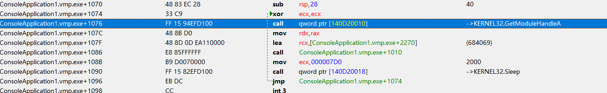

# VMP-Import-Fix

VMP-Import-Fix是一个能够对被vmp加密的IAT进行解密及修复，并且可对修复后的程序进行IAT节区构建后保存文件（支持无模块内存）。


# Before


# After




# Usage

```
-p: required.
Usage: VMP-Import-Fix [options]

Optional arguments:
-h --help       shows help message and exits
-v --version    prints version information and exits
-p --pid        process pid [required]
-m --module     module name,Default use process base. [default: ""]
-a --addr       module base,use hex with prefix,eg:0x1234 [default: "0x0"]
-l --len        module len,use hex with prefix,eg:0x1234 [default: "0x0"]
-d --dump       fix iat & dump to file [default: false]
-o --oep        if need dump,plz input oep with prefix,eg:0x1234 [default: "0x0"]
```

例如：

1、对某个进程进行修复

```
VMP-Import-Fix -p xxxxxx
```

2、对某个进程的模块进行修复

```
VMP-Import-Fix -p xxxxxx -m "xxxx.dll"
```

3、对某个进程的无模块进行修复

```
VMP-Import-Fix -p xxxxxx -a "0x7ffff000000" -l "0x1100"
```

4、对某个进程进行修复&构建IAT节区

```
VMP-Import-Fix -p xxxxxx -a "0x7ffff000000" -l "0x1100" -d -o 0x1347
```

# Credits

https://github.com/colby57/VMP-Imports-Deobfuscator